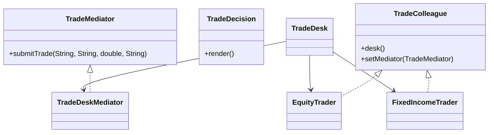

# Mediator Pattern

This example models a trade desk where traders send requests through a central mediator instead of calling each other directly. The mediator owns the coordination logic and keeps the colleagues loosely coupled.

## Why it fits

Trade desks often need routing and validation rules that should not be duplicated in each trader. Mediator centralizes that behavior and keeps each colleague focused on its own request.

## Structure

## Java features used

- Records for immutable trade decisions
- `Optional` for route derivation inside the mediator
- Interface-based colleagues to keep requesters decoupled
- Small coordination object that acts as the single integration point
