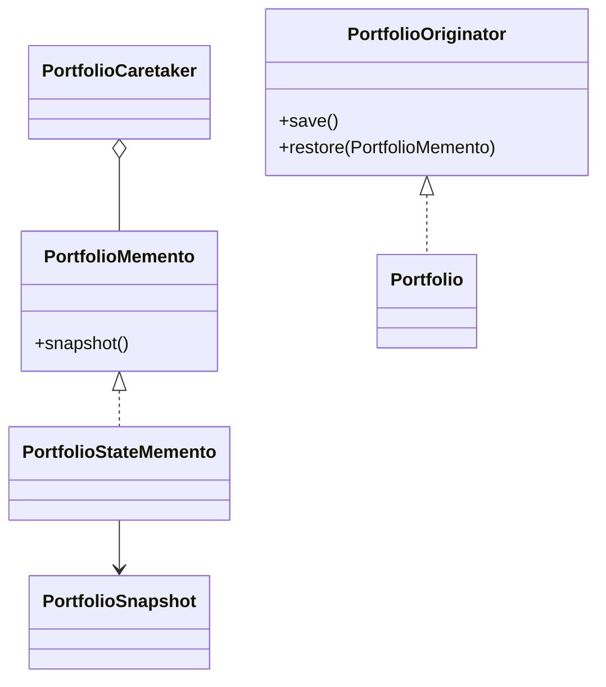

# Memento Pattern

This example models a portfolio that can save and restore its internal state. The originator owns the snapshot format, while the caretaker only stores mementos.

## Why it fits

Portfolio editing often needs undo support. Memento captures a safe snapshot without exposing internal representation to the caretaker or caller.

## Structure

## Java features used

- Records for immutable snapshot data
- `Optional` for primary holding lookup
- `Deque` for undo-style history
- Copy-on-save and copy-on-restore for safe state management

## Problem it solves

This pattern addresses a recurring design issue by separating responsibilities and reducing tight coupling in Memento Pattern scenarios.

## When to use

- Use this pattern when you need cleaner separation of concerns in Memento Pattern code.
- Use it when you expect variation in behavior and want to avoid complex conditionals.
- Use it when maintainability and extension are more important than one-off shortcuts.

## Example from Java/JDK

Memento style appears in APIs that capture and restore state snapshots.

- JDK classes: javax.swing.undo.UndoManager, javax.swing.undo.StateEdit
- Reference: https://docs.oracle.com/en/java/javase/25/docs/api/java.desktop/javax/swing/undo/UndoManager.html
