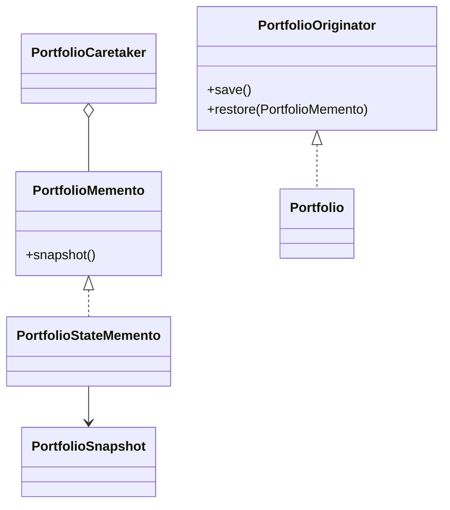

# Memento Pattern

This example models a portfolio that can save and restore its internal state. The originator owns the snapshot format, while the caretaker only stores mementos.

## Why it fits

Portfolio editing often needs undo support. Memento captures a safe snapshot without exposing internal representation to the caretaker or caller.

## Structure

## Java features used

- Records for immutable snapshot data
- `Optional` for primary holding lookup
- `Deque` for undo-style history
- Copy-on-save and copy-on-restore for safe state management
