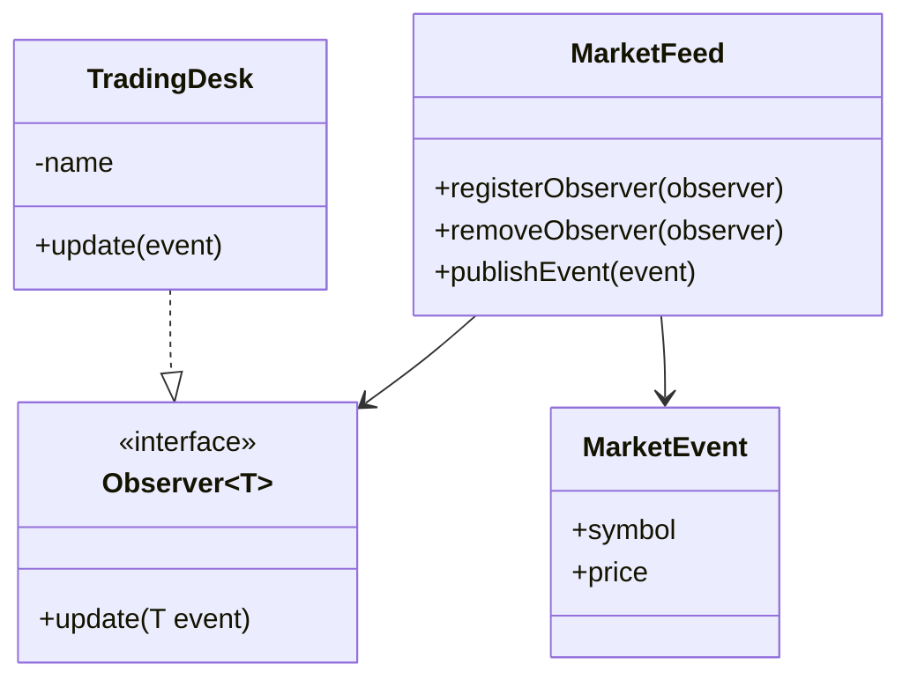

# Observer Pattern

This example demonstrates the Observer pattern in a trading context. A market feed publishes events to one or more trading desks that subscribe to updates.

## Structure

## How it works

- The feed maintains a list of observers.
- Observers subscribe and receive notifications whenever a new market event is published.
- The example uses lambda expressions and method references to show how different subscribers can be wired in.

## Problem it solves

This pattern addresses a recurring design issue by separating responsibilities and reducing tight coupling in Observer Pattern scenarios.

## When to use

- Use this pattern when you need cleaner separation of concerns in Observer Pattern code.
- Use it when you expect variation in behavior and want to avoid complex conditionals.
- Use it when maintainability and extension are more important than one-off shortcuts.

## Example from Java/JDK

Observer-like publish/subscribe is common in listener and event APIs.

- JDK classes: java.util.concurrent.Flow, java.beans.PropertyChangeListener
- Reference: https://docs.oracle.com/en/java/javase/25/docs/api/java.base/java/util/concurrent/Flow.html
