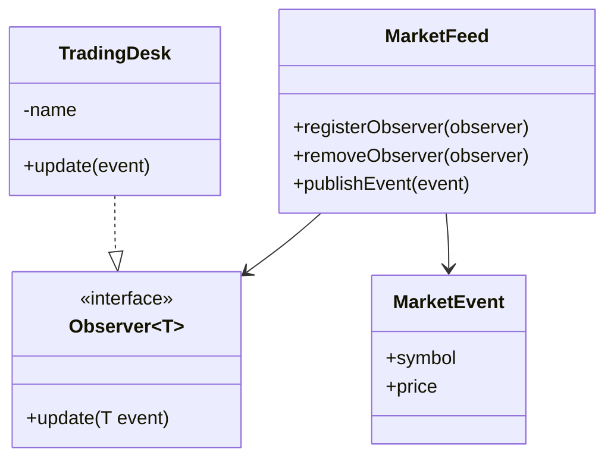

# Observer Pattern

This example demonstrates the Observer pattern in a trading context. A market feed publishes events to one or more trading desks that subscribe to updates.

## Structure

## How it works

- The feed maintains a list of observers.
- Observers subscribe and receive notifications whenever a new market event is published.
- The example uses lambda expressions and method references to show how different subscribers can be wired in.
