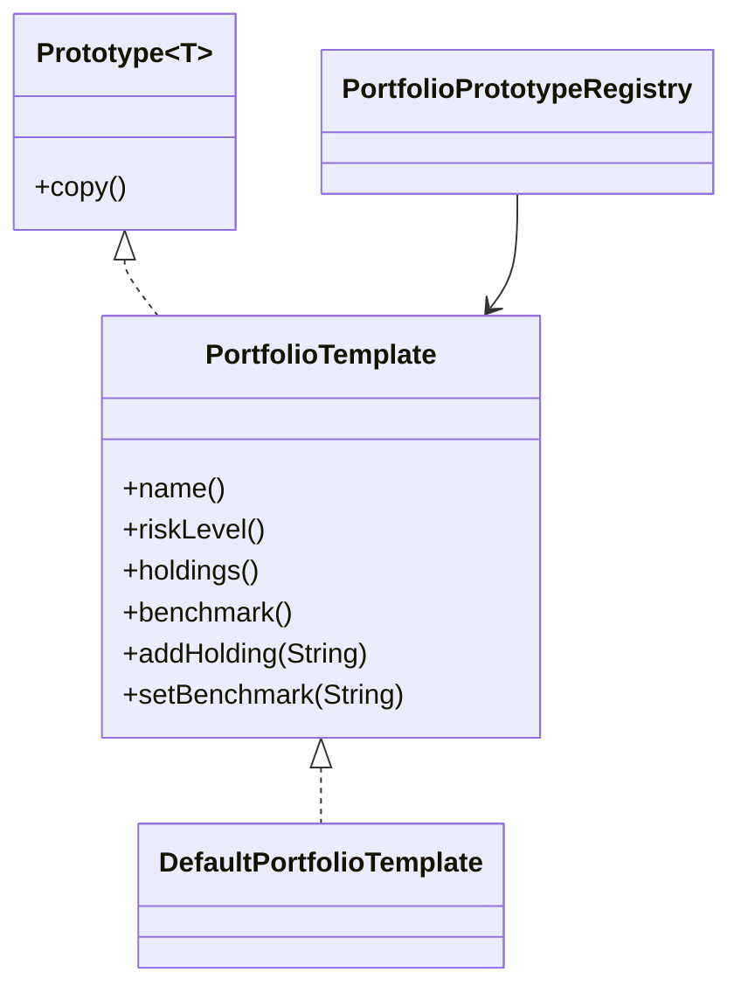

# Prototype Pattern

This example models portfolio templates that can be cloned and then customized. The registry stores a prototype, and callers receive a deep copy so they can modify it independently.

## Why it fits

A common portfolio shape is often reused as a starting point for new funds or model portfolios. Prototype avoids rebuilding the same structure from scratch and keeps the original template intact.

## Structure

## Java features used

- Generics for a reusable prototype contract
- `Optional` for benchmark metadata
- Copy constructors for deep-copy behavior
- Concurrent registry for safe template lookup
