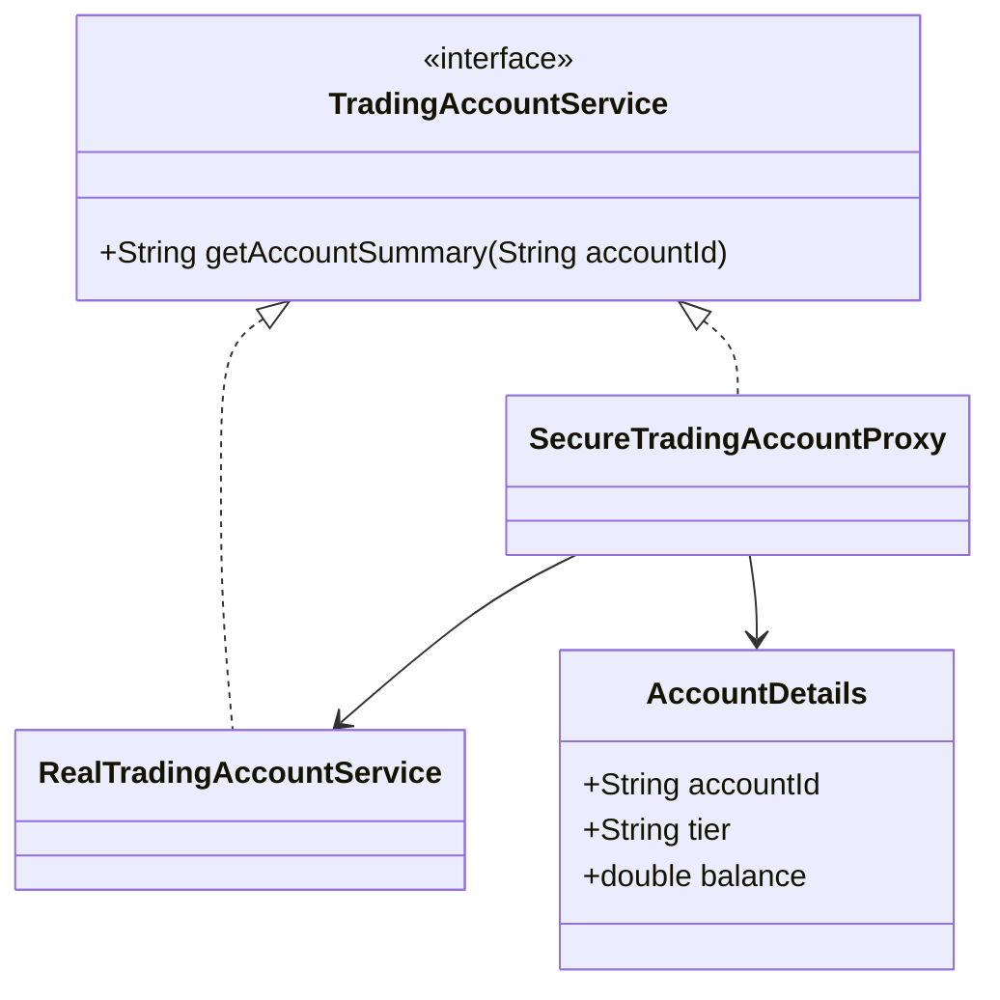

# Proxy Pattern

This example uses a proxy to control access to a sensitive trading account service while keeping the client-facing API consistent.

## Why this fits

The Proxy pattern is useful when access needs to be guarded, delayed, or logged. In finance systems, proxies are commonly used to protect account data or add validation before expensive operations.

## Java 25 features used

- Records for immutable account data
- Optional-based handling in the access layer
- Switch expressions for risk classification

## Mermaid diagram

## Flow

1. The client talks to the proxy through the same interface.
2. The proxy validates the request and decides whether to forward it.
3. The real service provides the account details when access is allowed.

## Problem it solves

This pattern addresses a recurring design issue by separating responsibilities and reducing tight coupling in Proxy Pattern scenarios.

## When to use

- Use this pattern when you need cleaner separation of concerns in Proxy Pattern code.
- Use it when you expect variation in behavior and want to avoid complex conditionals.
- Use it when maintainability and extension are more important than one-off shortcuts.

## Example from Java/JDK

Proxy is used to add indirection around real implementations.

- JDK classes: java.lang.reflect.Proxy, java.rmi.Remote
- Reference: https://docs.oracle.com/en/java/javase/25/docs/api/java.base/java/lang/reflect/Proxy.html
