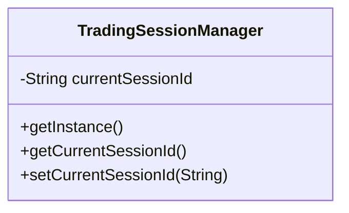

# Singleton Pattern

This example models a trading session manager using the singleton pattern. A single shared instance keeps the current trading session state for the whole application.

## Why this fits

The trading session should be globally consistent: market data subscriptions, order routing state, and risk checks all need to observe the same active session.

## Structure

## Java features used

- `volatile` and synchronized initialization for thread-safe lazy creation
- `Optional` to normalize blank session values
- A final class to prevent subclassing

## Problem it solves

This pattern addresses a recurring design issue by separating responsibilities and reducing tight coupling in Singleton Pattern scenarios.

## When to use

- Use this pattern when you need cleaner separation of concerns in Singleton Pattern code.
- Use it when you expect variation in behavior and want to avoid complex conditionals.
- Use it when maintainability and extension are more important than one-off shortcuts.

## Example from Java/JDK

Singleton is used for shared runtime-wide services or constants.

- JDK classes: java.lang.Runtime#getRuntime, java.awt.Desktop#getDesktop
- Reference: https://docs.oracle.com/en/java/javase/25/docs/api/java.base/java/lang/Runtime.html#getRuntime()
