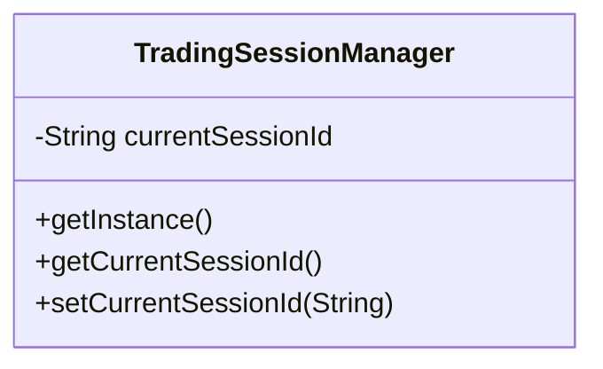

# Singleton Pattern

This example models a trading session manager using the singleton pattern. A single shared instance keeps the current trading session state for the whole application.

## Why this fits

The trading session should be globally consistent: market data subscriptions, order routing state, and risk checks all need to observe the same active session.

## Structure

## Java features used

- `volatile` and synchronized initialization for thread-safe lazy creation
- `Optional` to normalize blank session values
- A final class to prevent subclassing
