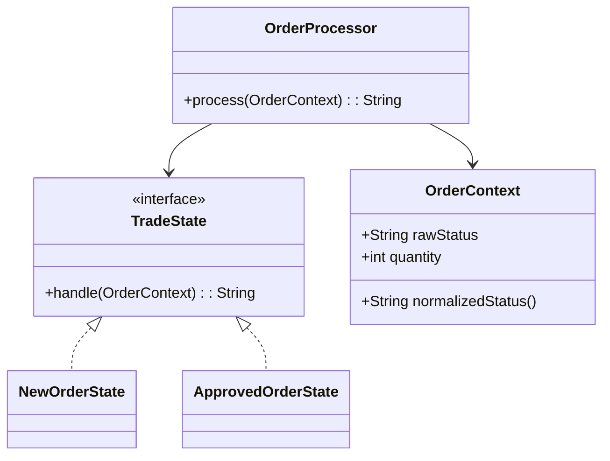

# State Pattern

This example models a trading order as a state machine. The order transitions through different states, and each state decides how to handle the request.

## Why this fits

The State pattern is useful when an object behaves differently depending on its current phase. In finance systems, orders often move through phases such as new, approved, and filled.

## Java 25 features used

- Record-based context data in `OrderContext`
- Pattern matching via `switch` expressions in state handlers
- Optional-based flow in the processor

## Mermaid diagram

## Flow

1. Create an `OrderContext` with the raw status and quantity.
2. Choose a state implementation such as `NewOrderState` or `ApprovedOrderState`.
3. Pass the context through `OrderProcessor` to get a state-specific response.

## Problem it solves

This pattern addresses a recurring design issue by separating responsibilities and reducing tight coupling in State Pattern scenarios.

## When to use

- Use this pattern when you need cleaner separation of concerns in State Pattern code.
- Use it when you expect variation in behavior and want to avoid complex conditionals.
- Use it when maintainability and extension are more important than one-off shortcuts.
