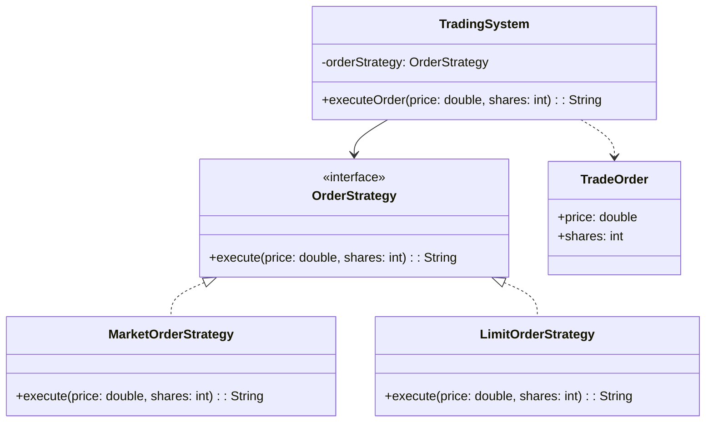

# Strategy Pattern

## Summary
The Strategy pattern lets an object choose an algorithm at runtime by delegating behavior to interchangeable strategy objects.

This example also shows two modern Java features:
- Lambda expressions are used to create strategy implementations inline.
- Optional is used to safely resolve a strategy from an enum value without null checks.

## Why it fits
- A trading system can switch between market and limit order execution without changing its own logic.
- New order types can be added by implementing the same interface.
- The client code depends on an abstraction rather than a concrete order type.
- Optional makes strategy lookup safer and clearer when a value may be missing.

## Class diagram

## SOLID notes
- Single Responsibility: the trading system orchestrates, while strategies encapsulate execution logic.
- Open/Closed: new strategies can be added without modifying existing code.
- Dependency Inversion: the trading system depends on the abstraction `OrderStrategy`.

## Problem it solves

This pattern addresses a recurring design issue by separating responsibilities and reducing tight coupling in Strategy Pattern scenarios.

## When to use

- Use this pattern when you need cleaner separation of concerns in Strategy Pattern code.
- Use it when you expect variation in behavior and want to avoid complex conditionals.
- Use it when maintainability and extension are more important than one-off shortcuts.
