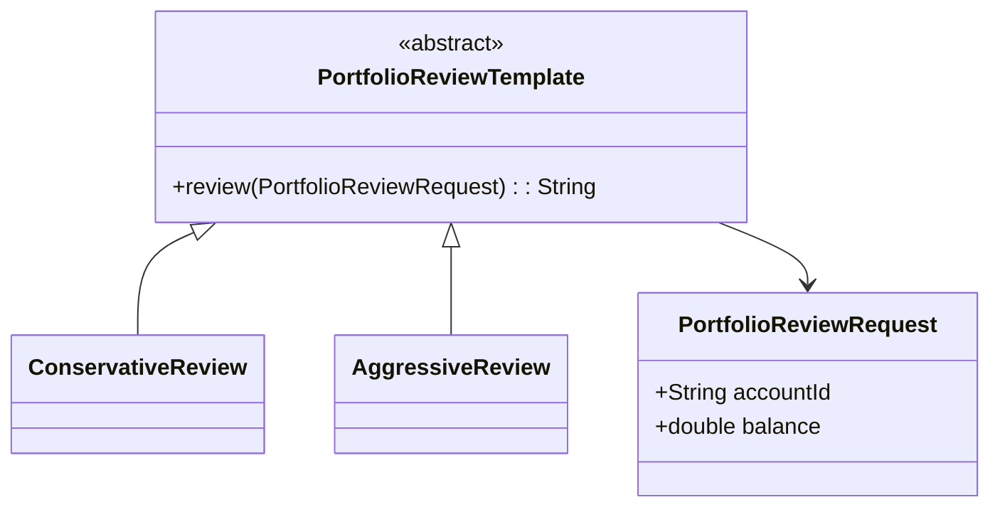

# Template Method Pattern

This example uses a template method to define the standard flow for reviewing a trading portfolio while allowing specific steps to vary by strategy.

## Why this fits

The Template Method pattern is useful when several implementations share the same overall process but differ in one or two steps. In finance, a review workflow often follows the same structure while using different risk checks.

## Java 25 features used

- Records for immutable review data
- Optional-based handling for missing values
- Switch expressions for risk classification

## Mermaid diagram

## Flow

1. The template defines the standard review order.
2. Concrete implementations override the specific risk steps.
3. The same review pipeline is reused for different portfolio strategies.

## Problem it solves

This pattern addresses a recurring design issue by separating responsibilities and reducing tight coupling in Template Method Pattern scenarios.

## When to use

- Use this pattern when you need cleaner separation of concerns in Template Method Pattern code.
- Use it when you expect variation in behavior and want to avoid complex conditionals.
- Use it when maintainability and extension are more important than one-off shortcuts.

## Example from Java/JDK

Template Method appears in base classes that define a workflow and defer steps.

- JDK classes: java.io.InputStream (read pattern), java.util.AbstractList
- Reference: https://docs.oracle.com/en/java/javase/25/docs/api/java.base/java/io/InputStream.html
