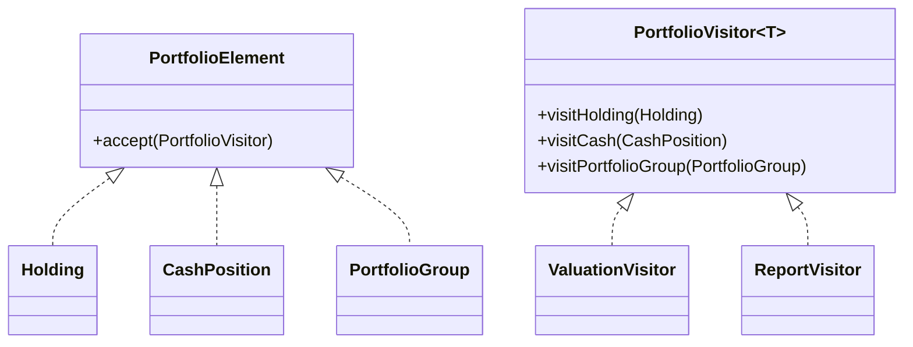

# Visitor Pattern

This example models a portfolio tree that accepts different visitors for valuation and reporting. The data structure stays stable while new operations can be added by introducing new visitors.

## Why it fits

Portfolio analysis often grows new operations over time: valuation, reporting, risk scoring, compliance checks, and more. Visitor lets those operations evolve without modifying the element classes.

## Structure

## Java features used

- Generic visitor interface for reusable result types
- Records for compact immutable portfolio nodes
- `Optional` for optional strategy metadata
- Stream aggregation inside the valuation visitor

## Problem it solves

This pattern addresses a recurring design issue by separating responsibilities and reducing tight coupling in Visitor Pattern scenarios.

## When to use

- Use this pattern when you need cleaner separation of concerns in Visitor Pattern code.
- Use it when you expect variation in behavior and want to avoid complex conditionals.
- Use it when maintainability and extension are more important than one-off shortcuts.

## Example from Java/JDK

Visitor-style dispatch appears where logic depends on element type without changing element classes.

- JDK classes: java.nio.file.FileVisitor, javax.lang.model.element.ElementVisitor
- Reference: https://docs.oracle.com/en/java/javase/25/docs/api/java.base/java/nio/file/FileVisitor.html
