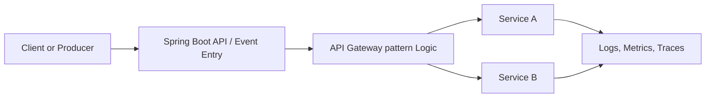

# API Gateway pattern

## Pattern explanation

Use a single entry point to route, secure, and shape requests to services.

## Problem it solves

This pattern reduces coupling and operational risk in distributed microservices systems by making boundaries and interactions explicit.

## When to use

- Use this pattern when service boundaries and team ownership need to stay clear.
- Use this pattern when reliability and independent deployability matter.
- Use this pattern when direct synchronous coupling is becoming a bottleneck.

## Basic flow

1. A request or event enters the system through an edge or producer component.
2. The pattern-specific coordination logic routes, persists, or transforms the work.
3. Downstream services process the work and emit results or events.
4. Observability signals record health, latency, and failure outcomes.

## Structure

- `src/main/java`: Spring Boot 4.1.0 application and pattern demo service.
- `src/test/java`: JUnit 5 tests validating the demo behavior.
- `build.gradle.kts`: Gradle build with Spring Boot and JUnit 5.
- `settings.gradle.kts`: Project identity for the pattern module.

## Java25 features used

- Records for immutable request/response examples.
- Switch expressions for concise routing logic.
- Text blocks for readable multi-line payload templates.
- Optional usage for safe absent-value handling.

## Mermaid diagram to show case and explain

